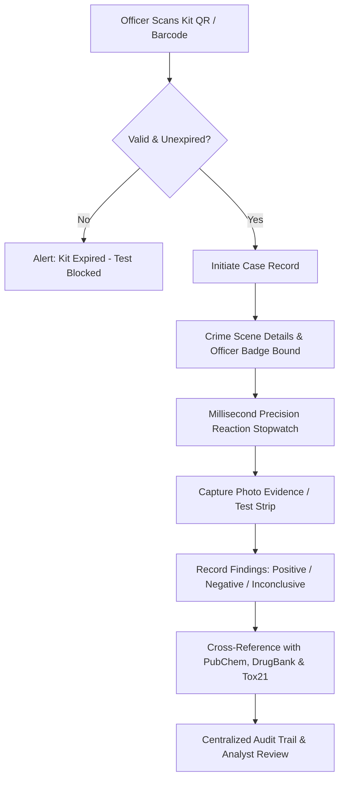
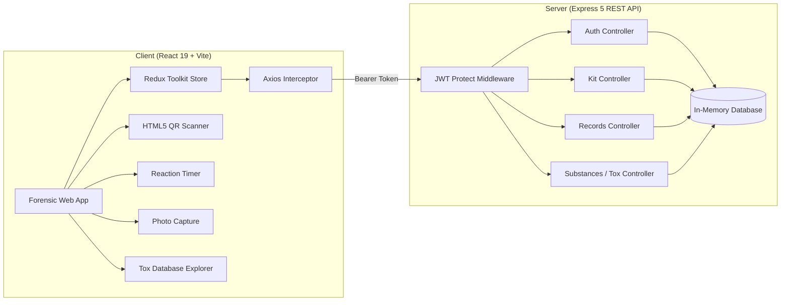

# 🔬 VishaTrace / NarcoVision — Forensic Kit Evidence & Traceability System

[](https://react.dev/)
[](https://vitejs.dev/)
[](https://expressjs.com/)
[](https://redux-toolkit.js.org/)
[](LICENSE)

> **"From sample detection to intelligent insight — VishaTrace helps transform field investigation through AI, real-world toxicological reference datasets, and digital chain of custody."**

---

## 🚨 Problem Statement

Field inspectors, forensic technicians, and law enforcement officers often need to collect and analyze suspicious evidence samples under challenging field conditions.

Traditional field testing procedures face significant challenges:
* ⏳ **Unstandardized Reaction Timing**: Chemical colorimetric assays depend on strict reaction intervals (e.g. 30–60 seconds). Misjudging time leads to false positives/negatives.
* 🧪 **Expired/Compromised Test Kits**: Field officers often lack instant tools to verify if an evidence test kit batch has expired or was recalled.
* 📋 **Broken Chain of Custody**: Handwritten logs make it difficult to correlate officer badges, crime scene GPS/locations, kit batch numbers, and high-resolution photo proof.
* 📚 **Lack of Real-time Toxicological Intelligence**: Field personnel frequently encounter unidentified synthetic opioids, stimulant precursors, and toxins without direct access to PubChem, DrugBank, or Tox21 toxicity profiles.

**VishaTrace** delivers an end-to-end digital tracking, decision-support, and toxicological reference system that enforces test validity, logs precise reaction timing, captures photo proof, and correlates field results with gold-standard scientific databases.

---

## 💡 System Solution & Flow



---

## 🧬 Integrated Scientific Datasets

VishaTrace integrates verified real-world toxicological and chemical datasets:

### 1. 🧪 NIH PubChem
* **Compound CIDs**: Cross-referenced with National Center for Biotechnology Information (NCBI) PubChem identifiers.
* **Chemical Structure**: Canonical SMILES strings, molecular weights, and formulas.
* **GHS Safety Hazards**: GHS06 acute toxicity, GHS08 health hazards, and handling precautions.

### 2. 💊 DrugBank
* **DrugBank Accession IDs**: e.g., `DB00907` (Cocaine), `DB00813` (Fentanyl), `DB01576` (Methamphetamine).
* **Pharmacological Action**: Mechanism of action, target receptor binding, and controlled substance scheduling.

### 3. 🔬 Tox21 (Toxicology in the 21st Century)
* **High-Throughput Assays**: Bioassay IDs from the interagency federal research initiative (NIH/EPA/FDA).
* **Toxicological Endpoints**: Mitochondrial membrane potential (SR-MMP), nuclear receptor activation, and cytotoxicity thresholds.

### 4. 🎨 Presumptive Colorimetric Test Reference
* Reagent color transformation benchmarks (Marquis, Scott's Cobalt Thiocyanate, Duquenois-Levine, Mecke, Mandelin) paired with expected latency and kit compatibility.

---

## ✨ Key Features

- 📸 **QR & Barcode Scanning**: Scan kit packaging via camera (using `html5-qrcode`) or lookup Kit ID manually with 1-tap quick select chips.
- ⏱️ **Precision Reaction Stopwatch**: Millisecond-accurate reaction timer with Start, Stop & Record, and Reset functions for colorimetric narcotics assays.
- 🖼️ **Digital Photo Evidence**: Attach live captured or uploaded test cassette / color reaction images directly to the incident record.
- 🧪 **Searchable Toxicological Database**: Instant compound lookup by name, molecular formula, SMILES, DrugBank ID, PubChem CID, or Tox21 assay.
- 🛡️ **Role-Based Access Control (RBAC)**: Field Officers log and track their assigned cases, while Forensic Analysts have full oversight of departmental records.
- 🎨 **Dark Forensic UI**: Clean, high-contrast dark theme (navy/slate/cyan) designed for field operation clarity and low-light environments.
- 📋 **Filterable Audit History**: Live status filtering (`all`, `pending`, `complete`) with badges and timestamps for chain of custody integrity.

---

## 🏛️ System Architecture



---

## 📂 Project Structure

```text
vishtrace/
├── client/
│   ├── index.html
│   ├── vite.config.js
│   ├── package.json
│   └── src/
│       ├── main.jsx                    # Root entry point with Redux Provider
│       ├── App.jsx                     # Layout, route guards, and navigation
│       ├── index.css                   # Dark forensic theme & utility classes
│       ├── components/
│       │   ├── Navbar.jsx              # Fixed top bar with badge, tox db & logout
│       │   ├── ProtectedRoute.jsx      # Route guard for authenticated users
│       │   ├── ReactionTimer.jsx       # Stopwatch component for chemical assays
│       │   ├── ImageCapture.jsx        # Photo upload & camera capture
│       │   └── EvidenceRecord.jsx      # Reusable case card with status badges
│       ├── pages/
│       │   ├── Login.jsx               # Officer authentication
│       │   ├── Signup.jsx              # New officer registration
│       │   ├── Dashboard.jsx           # Stats, active kits & recent cases
│       │   ├── ScanKit.jsx             # Camera QR reader & manual lookup
│       │   ├── KitDetails.jsx          # Kit specs, contents & case creator
│       │   ├── TestResult.jsx          # Assay timer, photo evidence & notes
│       │   ├── History.jsx             # Full audit trail & evidence filtering
│       │   └── SubstanceDatabase.jsx   # PubChem, DrugBank & Tox21 scientific reference
│       ├── services/
│       │   └── api.js                  # Axios client with bearer token injection
│       └── store/
│           ├── index.js                # Redux store config
│           └── authSlice.js            # Authentication thunks & state
│
├── server/
│   ├── server.js                       # Express app entry & middleware
│   ├── package.json
│   └── src/
│       ├── db.js                       # In-memory kits & records storage
│       ├── db/
│       │   ├── user.js                 # Demo users & bcrypt hashing
│       │   └── substances.js           # Curated PubChem, DrugBank & Tox21 records
│       ├── middleware/
│       │   └── auth.js                 # JWT bearer token verification
│       └── routes/
│           ├── auth.js                 # POST /login, POST /signup, GET /me
│           ├── kits.js                 # GET /kits, GET /kits/:id
│           ├── testRecords.js          # CRUD for test records
│           └── substances.js           # GET /substances (search & filter), GET /substances/:id
│
├── .gitignore
├── Readme.md                           # System documentation
└── start.bat                           # 1-Click launcher for Windows
```

---

## 📡 API Documentation

Base URL: `http://localhost:5000/api`

### Authentication (`/auth`)
| Method | Endpoint | Description | Auth Required |
| :--- | :--- | :--- | :--- |
| `POST` | `/auth/login` | Sign in with email & password | No |
| `POST` | `/auth/signup` | Register a new officer account | No |
| `GET` | `/auth/me` | Fetch active user profile from JWT | Yes (Bearer) |

### Evidence Kits (`/kits`)
| Method | Endpoint | Description | Auth Required |
| :--- | :--- | :--- | :--- |
| `GET` | `/kits` | Retrieve all registered forensic kits | Yes (Bearer) |
| `GET` | `/kits/:id` | Get technical specifications by Kit ID | Yes (Bearer) |

### Test Records (`/records`)
| Method | Endpoint | Description | Auth Required |
| :--- | :--- | :--- | :--- |
| `GET` | `/records` | List records (Officers see own, Analysts see all) | Yes (Bearer) |
| `POST` | `/records` | Create new case record with kit | Yes (Bearer) |
| `GET` | `/records/:id` | Get record details by ID | Yes (Bearer) |
| `PATCH` | `/records/:id` | Update findings, reaction time, photo & notes | Yes (Bearer) |

### Toxicological & Chemical Database (`/substances`)
| Method | Endpoint | Description | Auth Required |
| :--- | :--- | :--- | :--- |
| `GET` | `/substances` | Search & filter indexed compounds (`?q=`, `?source=`, `?classification=`) | Yes (Bearer) |
| `GET` | `/substances/:id` | Get detailed chemical profile, SMILES, PubChem, DrugBank & Tox21 data | Yes (Bearer) |

---

## 🔑 Demo Kits & Credentials

### Pre-Configured Users
| Role | Name | Email | Password | Badge Number |
| :--- | :--- | :--- | :--- | :--- |
| **Field Officer** | Officer Aditya | `aditya@vishtrace.io` | `password123` | `OFC-4521` |
| **Lab Analyst** | Dr. Priya Sharma | `priya@vishtrace.io` | `password123` | `ANL-1102` |

### Sample Kit Catalog
| Kit ID | Name | Type | Status | Expiry Date |
| :--- | :--- | :--- | :--- | :--- |
| `KIT-001` | Rapid DNA Test Kit Alpha | DNA | Active | 2026-12-31 |
| `KIT-002` | Bloodstain Analysis Kit Beta | Blood | Active | 2025-09-30 |
| `KIT-003` | Narcotics Field Test Kit | Narcotics | Active | 2026-06-15 |
| `KIT-004` | Fingerprint Dusting Kit Delta | Fingerprint | **Expired** | 2025-03-01 |
| `KIT-005` | Trace Evidence Collection Epsilon | Trace | Active | 2027-01-20 |

---

## ⚙️ Getting Started

### Prerequisites
* [Node.js](https://nodejs.org/) v18+ (tested on v24)
* npm

### Quick Start (Windows)
Double click `start.bat` in the root folder, or execute:
```cmd
start.bat
```

### Manual Installation

#### 1. Backend Server Setup
```bash
cd server
npm install
npm run dev
# Server running at http://localhost:5000
```

#### 2. Frontend Client Setup
```bash
cd client
npm install
npm run dev
# Frontend running at http://localhost:5173
```

---

## 👥 Team & Institution

* **Project:** VishaTrace / NarcoVision
* **Domain:** Artificial Intelligence / Forensic Technology / Evidence Traceability
* **Institution:** SGGS Institute of Engineering & Technology, Nanded

---

## ⚠️ Important Disclaimer

VishaTrace is intended as an **assistive field evidence tracking and decision-support prototype**. Preliminary chemical assay results should be confirmed through certified forensic laboratory procedures and qualified laboratory personnel.

---

## 📜 License

This project is developed for educational, research, and innovation purposes under the MIT License.
